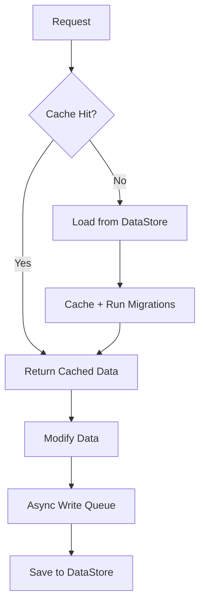

# PaoPao’s DataStore Module (PPDB)

PPDB is a **production-oriented DataStore wrapper for Roblox**.
It exists because raw `GetAsync` / `SetAsync` usage does not scale well once a game grows beyond a prototype.

PPDB does not try to hide DataStore. Instead, it provides **structure, safety, and predictable behavior** around it.

The goal is simple:

- Make reads cheap
- Make writes non-blocking
- Make schema changes survivable
- Avoid losing data during shutdown

If you have ever thought:

> “Why is saving player data this annoying?”

PPDB is designed for that exact problem.

---

## Overview

PPDB follows a **cache-first, async-write** model.

- Data is loaded once and cached in memory
- All reads prefer cache
- Writes are queued and flushed asynchronously
- Shutdown triggers a synchronous flush

You should not need to:

- Call DataStore APIs directly
- Reimplement retry logic
- Manually handle server shutdown edge cases

---

## Features

### Global Shared Cache

Instances that reference the same DataStore name share a **single in-memory cache per server**.

This avoids redundant `GetAsync` calls and prevents accidental state divergence inside the same server.

---

### Non-blocking Reads and Writes

- Reads return immediately from cache when possible
- Writes are queued and executed asynchronously
- Gameplay logic never waits on DataStore I/O

---

### Shadow Copy on Write

Before a write occurs, PPDB creates a snapshot of the data.

This prevents race conditions between:

- ongoing reads
- concurrent updates
- asynchronous writes

---

### Migration Support

PPDB supports ordered migration functions that run after data is loaded.

This allows:

- evolving schemas
- adding/removing fields safely
- avoiding destructive resets

If a migration fails, the original data remains intact.

---

### Lifecycle Events

PPDB exposes signals for key lifecycle moments:

- `OnInit` — data loaded and cached
- `OnSave` — data updated
- `OnDelete` — data removed from cache

These are intended for side-effects and integrations, not core logic.

---

### Retry Logic

Transient DataStore failures are expected.

PPDB retries failed operations automatically with delays between attempts.
This prevents single-request failures from breaking gameplay flow.

---

### Debug Mode

When enabled, debug mode logs:

- retry attempts
- migration failures
- write errors

This is intended for development and staging environments.

---

## How It Works (High-Level)

PPDB’s internal flow is intentionally simple:

1. Request data
2. Check cache
3. Load from DataStore if missing
4. Cache and migrate
5. Return data
6. Queue writes asynchronously



---

## When PPDB Is a Good Fit

PPDB is most useful when you are past the prototype phase and start hitting **real DataStore problems**.

### 1. Player Data That Lives for the Entire Session

**Typical examples**

- Player stats (level, XP, currency)
- Inventory / loadouts
- Progress flags, unlocks

**Why PPDB helps**

- Data is loaded once (`init`) and cached
- Reads are effectively free after that
- Writes do not block gameplay
- Automatic flush on leave / shutdown

This avoids the common anti-pattern of calling `GetAsync` and `SetAsync` repeatedly during gameplay.

---

### 2. Games With Moderate to High Server Count

If your game runs **many servers concurrently**, PPDB helps by:

- Reducing redundant DataStore reads
- Lowering write frequency via batching
- Avoiding per-action `SetAsync` calls

It does not provide strong consistency, but it dramatically reduces accidental abuse of DataStore quotas.

---

### 3. Games That Evolve Their Data Schema

If your game:

- Adds new fields over time
- Renames fields
- Changes data structure versions

PPDB’s migration system allows you to:

- Load old data safely
- Transform it in memory
- Save it back in the new shape

No forced wipes, no version spaghetti in gameplay code.

---

### 4. Async-Heavy Codebases

PPDB is useful when you want:

- Clean gameplay logic
- Minimal callback hell
- Predictable data lifecycle

You interact with cached tables, not DataStore promises.

---

## How PPDB Handles Multiple Servers Accessing the Same Data

Short answer: **soft coordination, not strict locking**.

### The Reality

Roblox DataStore:

- Is eventually consistent
- Has no true cross-server mutex
- Can overwrite data silently if misused

PPDB embraces this reality instead of pretending it doesn’t exist.

---

### What PPDB Does

1. **Cache-first design**
   - Each server works primarily on its own cached copy
   - Reduces read contention immediately

2. **Best-effort soft locking**
   - Uses MemoryStore as a coordination hint
   - Attempts to reduce simultaneous writes
   - Not a hard guarantee

3. **Last-write-wins model**
   - If two servers write the same key:
     - The later write overwrites the earlier one

   - This is intentional and documented

4. **Shadow copy on write**
   - Writes operate on snapshots
   - Prevents corruption inside a single server
   - Does not prevent logical conflicts across servers

---

### What PPDB Does _Not_ Do

- ❌ No atomic multi-server transactions
- ❌ No guaranteed mutual exclusion
- ❌ No automatic conflict resolution

If your game allows:

- Multiple servers modifying the same player at once

Then you **must design higher-level rules**, such as:

- One server owns a player at a time
- Only write on join/leave
- Treat cross-server updates as eventual, not immediate

PPDB makes this survivable, not magical.

---

## Migration Function Examples

Migration functions are **pure transforms**:

- Input: old data table
- Output: new data table
- Must not rely on external state

They run **in order**, every time data is loaded.

---

### Example 1: Adding a New Field

```lua
function migrateAddGold(data)
    if data.gold == nil then
        data.gold = 0
    end
    return data
end
```

**Use case**

- Introducing a new currency
- Safe for old and new players

---

### Example 2: Renaming a Field

```lua
function migrateRenameXP(data)
    if data.xp ~= nil then
        data.experience = data.xp
        data.xp = nil
    end
    return data
end
```

**Use case**

- Cleaning up naming mistakes
- Avoids breaking old saves

---

### Example 3: Structural Change

```lua
function migrateInventoryStructure(data)
    if type(data.inventory) == "table" and data.inventory.items == nil then
        data.inventory = {
            items = data.inventory,
            capacity = 50,
        }
    end
    return data
end
```

**Use case**

- Moving from flat arrays to structured objects

---

### Example 4: Versioned Migration (Recommended Pattern)

```lua
function migrateVersioned(data)
    data._version = data._version or 1

    if data._version < 2 then
        data.gold = data.gold or 0
        data._version = 2
    end

    return data
end
```

**Why this is good**

- Migrations become idempotent
- Easier to reason about long-term
- Safer when adding future migrations

---

## Migration Rules (Important)

- Always return a table
- Never mutate external state
- Expect migrations to run more than once
- Treat input data as untrusted

A failed migration should **not corrupt data** — PPDB will keep the original if the migration errors.

---

## Quick Start

- **Getting Started** explains basic usage patterns
- **API Reference** documents all public methods and signals

[Getting Started](./tutorial/setup.md){ .md-button }
[API Reference](./reference/api.md){ .md-button }

---

## What PPDB Does Not Guarantee

PPDB is intentionally pragmatic, not magical.

It does **not** guarantee:

- strong cross-server consistency
- atomic multi-key transactions
- protection against last-write-wins in all cases

---

## Notes from Me

!!! note "Important"

```
- The API is mostly stable, but not frozen
- Some changes may occur to improve performance or correctness
- Bug reports and well-justified pull requests are welcome
- I use some AI tools to write this documentation (btw)

This project prioritizes correctness and real-world usability over theoretical perfection.
```

---

## License

PPDB is released under the **MIT License**.

You are free to use, modify, and distribute it in both personal and commercial projects.

[View License](https://raw.githubusercontent.com/Paopun20/PaoPaoDataStore/main/LICENSE){ .md-button }
