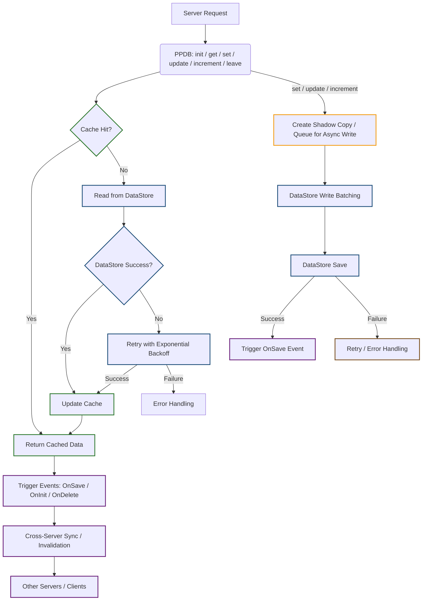

# PaoPao's DataStore Module (PPDB)

PPDB is a high-performance Roblox DataStore wrapper that simplifies the management of persistent data with advanced caching, cross-server synchronization, and migration capabilities. It is designed to be robust, efficient, and developer-friendly, allowing you to focus on creating engaging gameplay experiences without worrying about the complexities of data storage.

## Features

## Overview

* **Global shared cache** – Unified cache across all instances for fast, consistent reads.
* **Non-blocking read/write with Shadow Copy** – Uses snapshot copies of data before writing, ensuring reads never block writes and writes never block reads.
* **Automatic migration system** – Run migration functions to safely update data structures over time.
* **Event-driven architecture** – Signals like `OnInit`, `OnSave`, and `OnDelete` allow real-time reaction to data changes.
* **Retry logic with exponential backoff** – Handles transient DataStore failures gracefully with configurable retries.
* **Optional debug mode** – Logs operations, retries, and migration issues for easier troubleshooting.

## How it work (not full details yet)

---

## Quick Start

To get started with PPDB, check out the detailed documentation and tutorials:

[Getting Started Guide](./tutorial/setup.md){ .md-button }
[API Reference](./reference/api.md){ .md-button }

---

## License

PPDB is released under the **MIT**. This permissive license allows you to use, modify, and distribute PPDB in both personal and commercial projects.

[See the LICENSE file for complete details.](https://raw.githubusercontent.com/Paopun20/PaoPaoDataStore/main/LICENSE  ){ .md-button }

---

## Note from (solo) Dev

!!! note "note 1 (Important)"

    !!! note "sub-note 1"
        PPDB represents a production-ready DataStore solution with enterprise features. While the API is stable, we continuously improve performance and add features based on community feedback.
        
    !!! note "sub-note 2 (A Very Important!)"

        some api changes may occur in the future, so please check back regularly for updates, not 100% guaranteed that the api will not change, but i will try to keep it stable.

    !!! note "sub-note 3"
        If you encounter any issues or have suggestions for improvement, please open an issue on the [GitHub repository](https://github.com/Paopun20/PaoPaoDataStore/issues  ) but good /w pull request and bug fixes in pull request.

