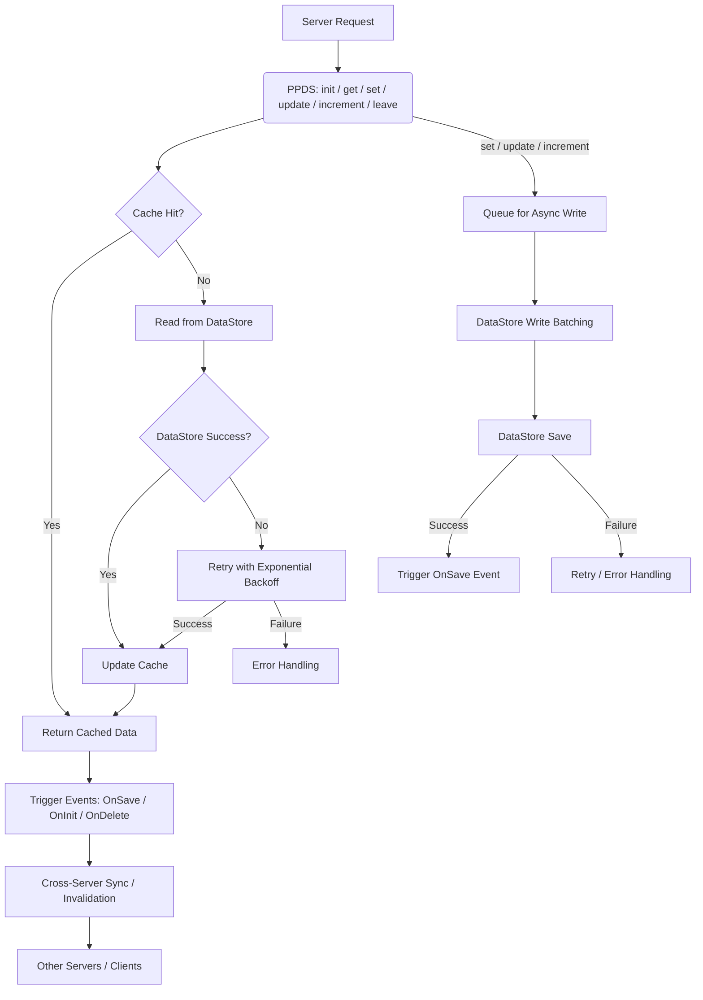

# PaoPao's DataStore Module (PPDS)

PPDS is a high-performance Roblox DataStore wrapper that simplifies the management of persistent data with advanced caching, cross-server synchronization, and migration capabilities. It is designed to be robust, efficient, and developer-friendly, allowing you to focus on creating engaging gameplay experiences without worrying about the complexities of data storage.

## Features

- **Global Shared Cache**: Data is cached across all server instances, ensuring consistency and reducing DataStore calls.
- **Cross-Server Locking**: Prevents data corruption from concurrent writes across multiple servers using MemoryStoreService.
- **Automatic Data Migrations**: Seamlessly update your data structure over time without losing player data.
- **Event-Driven Architecture**: Integrate with your game logic using `OnInit`, `OnSave`, `OnDelete`, and `OnInvalidate` events.
- **Robust Error Handling**: Built-in exponential backoff retry logic for DataStore operations.
- **Session Management**: Efficiently handle player data loading, saving, and cleanup.
- **Development Tools**: Export/import cache snapshots for debugging and testing.

## How it work (not full details yet)

---

## Quick Start

To get started with PPDS, check out the detailed documentation and tutorials:

[Getting Started Guide](./tutorial/setup.md){ .md-button }
[API Reference](./reference/api.md){ .md-button }

---

## License

PPDS is released under the **Apache License 2.0**. This permissive license allows you to use, modify, and distribute PPDS in both personal and commercial projects.

[See the LICENSE file for complete details.](https://raw.githubusercontent.com/Paopun20/PaoPaoDataStore/main/LICENSE){ .md-button }

---

## Note from (solo) Dev

!!! note "note 1 (Important)"

    !!! note "sub-note 1"
        PPDS represents a production-ready DataStore solution with enterprise features. While the API is stable, we continuously improve performance and add features based on community feedback.
        
    !!! note "sub-note 2 (A Very Important!)"

        some api changes may occur in the future, so please check back regularly for updates, not 100% guaranteed that the api will not change, but i will try to keep it stable.

    !!! note "sub-note 3"
        If you encounter any issues or have suggestions for improvement, please open an issue on the [GitHub repository](https://github.com/Paopun20/PaoPaoDataStore/issues) but good /w pull request and bug fixes in pull request.

